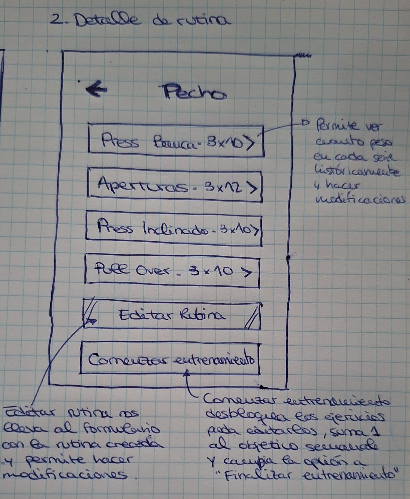
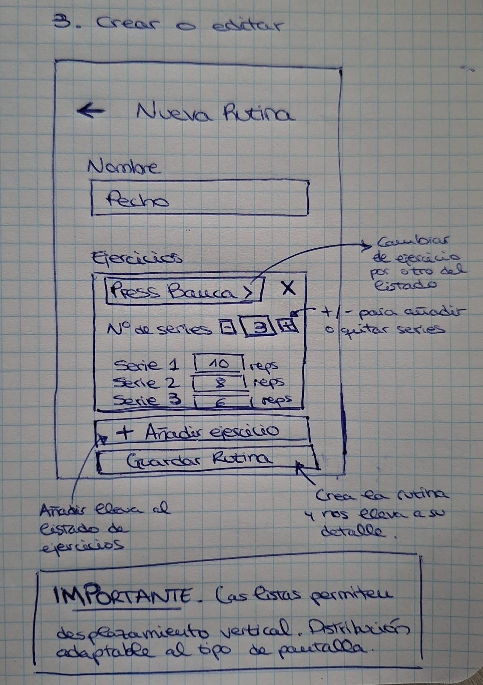

PROPUESTA DEL PROYECTO A

# Plantilla: propuesta del Proyecto A

---

## 0 · Datos

| |                     |
|---|---------------------|
| **Nombre de la app** | SimpleGym           |
| **Autor/a** | Sergio Romero Pérez |
| **Fecha** | 01/10/2026          |

---

## 1 · La idea en una frase

Una app que permite a personas que entrenan en un gimnasio organizar sus rutinas y registrar el peso y las repeticiones de cada ejercicio para seguir su progreso.

---

## 2 · El problema

Al entrenar en el gimnasio, es fácil olvidar qué peso y cuántas repeticiones se hicieron en la sesión anterior, lo que dificulta conseguir un progreso real. Sin la app, esta información se guarda en una libreta, en las notas del móvil o se intenta recordar. SimpleGym reunirá las rutinas y registros de cada entrenamiento en un mismo lugar, permitiendo consultar el histórico de cada ejercicio y comparar los resultados entre sesiones.

---

## 3 · Personas usuarias

- Un posible usuario sería Sergio, de 31 años, que entrena en el gimnasio y utiliza el móvil con soltura.
- Abre SimpleGym al comenzar su entrenamiento para consultar la rutina.
- Entre series, dedica unos segundos a actualizar el peso y las repeticiones de cada ejercicio si hay cambios respecto a la sesión anterior.
- Si la app falla y pierde lo registrado, tendría que volver a introducir los datos de memoria, por lo que es importante guardar cada serie y poder retomar la sesión. La app no cumpliría su propósito principal en el caso de falle en este aspecto.

---

## 4 · Funcionalidades

### Imprescindibles (sin esto la app no tiene sentido)

| # | Funcionalidad                                                                                                             |
|---|---------------------------------------------------------------------------------------------------------------------------|
| F1 | Crear, editar y eliminar rutinas con los ejercicios que se realizarán.                                                    |
| F2 | Registrar el peso y las repeticiones de cada serie, guardando los datos para poder retomar un entrenamiento sin terminar. |
| F3 | Consultar el histórico de cada ejercicio por fechas para comparar los resultados entre sesiones.                          |

### Opcionales (si sobra tiempo)

| #  | Funcionalidad                                                                                                                                                                                                                                                 |
|----|---------------------------------------------------------------------------------------------------------------------------------------------------------------------------------------------------------------------------------------------------------------|
| O1 | Registrar los pasos diarios, establecer un objetivo y consultar qué días se ha cumplido.                                                                                                                                                                      |
| O2 | Consultar un catálogo de ejercicios con instrucciones y músculos trabajados, obtenido de una API propia.                                                                                                                                                      |
| O3 | Sustituir un ejercicio durante el entrenamiento por una alternativa similar consultada en la API, mostrando su último peso registrado o 0 kg si no tiene registros previos.                                                                                   |
| O4 | Consultar un catálogo de ejercicios con instrucciones y músculos trabajados, obtenido de una API propia.                                                                                                                                                      |
| O5 | Establecer un objetivo semanal de asistencia al gimnasio y consultar si se ha cumplido.                                                                                                                                                                                                                                                            |

---

## 5 · Pantallas

| Pantalla               | Para qué sirve                                                                                                                              | Se llega desde                                                                              |
|------------------------|---------------------------------------------------------------------------------------------------------------------------------------------|---------------------------------------------------------------------------------------------|
| Inicio: mis rutinas    | Mostrar las rutinas guardadas, crear una nueva y consultar el progreso del objetivo semanal de asistencia                                   | Arranque de la aplicación                                                                   |
| Detalle de rutina      | Consultar los ejercicios de una rutina, sus series y repeticiones previstas. Permite editar la rutina o comenzar el entrenamiento.          | Inicio: mis rutinas.                                                                        |
| Crear o editar rutina  | Introducir el nombre de la rutina, añadir o eliminar ejercicios y configurar sus series o repeticiones                                      | Inicio, para crear; detalle de rutina, para editar                                          |
| Entrenamiento en curso | Registrar el peso y las repeticiones de cada serie. Guardar automáticamente los cambios y finalizar la sesión cuando lo indique el usuario. | Detalle de rutina, al pulsar `Comenzar entrenamiento`; Inicio, si hay una sesión pendiente. |
| Histórico de ejercicio | Consultar los pesos y las repeticiones registrados en sesiones anteriores, organizados por fechas, para comprobar la evolución.             | Detalle de rutina o entrenamiento en curso, al tocar un ejercicio.                          |

El **objetivo semanal de asistencia** se puede configurar desde `Inicio`, sin necesitar otra pantalla. Las funciones opcionales, como los pasos diarios o el seguimiento del peso corporal, pueden incorporarse más adelante.

---

## 6 · Bocetos

> Añado a continuación, y en orden, los bocetos 1 (Lista), 2 (Detalle) y 3 (Formulario).

---

## 7 · Qué datos guarda la app

| Tipo de dato            | Campos                                                                             | Ejemplo                                                       |
|-------------------------|------------------------------------------------------------------------------------|---------------------------------------------------------------|
| Rutina                  | Identificador, nombre, ejercicios que contiene                                     | Rutina 1, "Pecho", ["press banca", "pull over"]               |
| Ejercicio               | Identificador, nombre, foto (opcional)                                             | Ejercicio 1, "Press banca", foto del ejercicio                |
| Ejercicio de una rutina | Rutina, ejercicio, orden, series y repeticiones de cada serie                      | "Pecho", "Press banca", 1º, 3 y 10, 8 y 6                     |
| Entrenamiento           | Identificador, rutina, fecha y hora de inicio, fecha y hora de fin, estado         | Entrenamiento 1, "Pecho", 02/10/2026 a las 18:00, en curso    |
| Serie realizada         | Entrenamiento, ejercicio, número de serie, repeticiones realizadas, peso utilizado | Entrenamiento 1, "Press banca", serie 2, 8 repeticiones, 40kg |
| Objetivo semanal        | Número de días que se quiere entrenar por semana                                   | Entrenar 3 días por semana                                    |

>**Cómo se relacionan:**

- Una rutina contiene varios ejercicios. Un ejercicio puede aparecer en varias rutinas, con diferente número de series y repeticiones.
- Cada entrenamiento corresponde a una rutina y guarda las series realizadas en esa sesión.
- Cada serie realizada pertenece a un entrenamiento y a un ejercicio.
- El histórico de un ejercicio se obtiene consultando sus series realizadas en las distintas fechas. Así puedes recuperar su último peso aunque lo hagas en otra rutina.
- Los días de asistencia se calculan a partir de los entrenamientos finalizadas y se comparan con el objetivo semanal.
- El número de series previstas se obtiene contando las series configuradas.

---

## 8 · Encaje con los requisitos del módulo

> Apartado obligatorio: ninguna casilla puede quedar vacía.

| Requisito | Dónde encaja en tu app                                                                                                                                                                                                                            | Tema |
|-----------|---------------------------------------------------------------------------------------------------------------------------------------------------------------------------------------------------------------------------------------------------|------|
| **Persistencia de datos** — la información sobrevive al cerrar la app | Guardar las rutinas, las series y las repeticiones utilizadas, los pesos utilizados, el histórico de entrenamiento y el objetivo semanal de asistencia. Guardar automáticamente la sesión en curso para poder retomarla al volver a abrir la app. | 4 |
| **Servicio web** — la app consulta datos por internet | Consultar una API de ejercicios para mostrar los músculos trabajados y las instrucciones de ejecución del ejercicio asociado a cada máquina del gimnasio.                                                                                         | 5 |
| **Sensor o localización** | Utilizar la cámara para escanear los códigos QR colocados en las máquinas del gimnasio. Cada código identifica un ejercicio y permite abrir su ficha en la app.                                                                                   | 6 |
| **Contenido multimedia** — foto, audio, vídeo o animación | Permitir tomar o seleccionar una fotografía y asociarla a un ejercicio para identificarlo visualmente o reconocer una máquina utilizada.                                                                                                          | 7 |

---

## 9 · Riesgos

| Lo que me preocupa                                                                     | Plan B                                                                                                                                     |
|----------------------------------------------------------------------------------------|--------------------------------------------------------------------------------------------------------------------------------------------|
| Que la API de ejercicios falle, pase a ser de pago o no tenga la información necesaria | Buscar otra API y conservar datos de ejemplo en la app para que las fichas sigan siendo consultables sin conexión.                         |
| Que se pierdan los datos al cerrar la app durante el entrenamiento                     | Guardar después de cada serie y recuperar la sesión pendiente al abrir la app. Si se complica, añadir también un botón de guardado manual. |

---

## Antes de entregar

- [x] La idea cabe en una frase.
- [x] El público es una persona concreta, no «todo el mundo».
- [x] Hay **3 o 4** funcionalidades imprescindibles, no diez.
- [x] Cada funcionalidad imprescindible tiene su pantalla.
- [x] Hay bocetos de las pantallas principales.
- [x] **Las cuatro casillas del apartado 8 están rellenas.**
- [x] Está identificado al menos un riesgo con su plan B.
